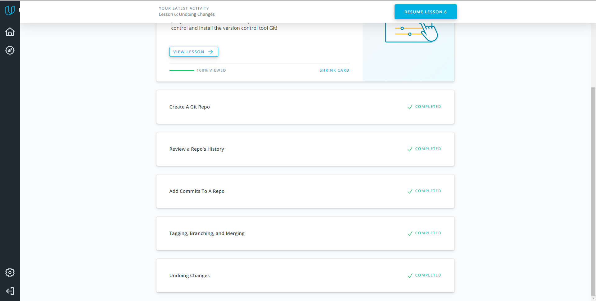
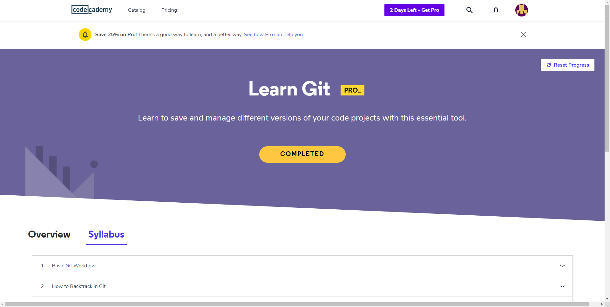
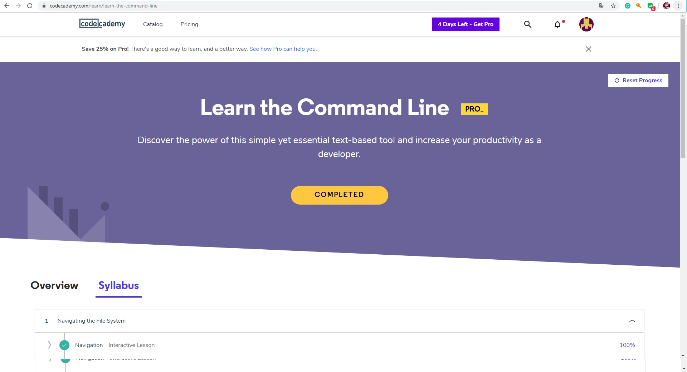
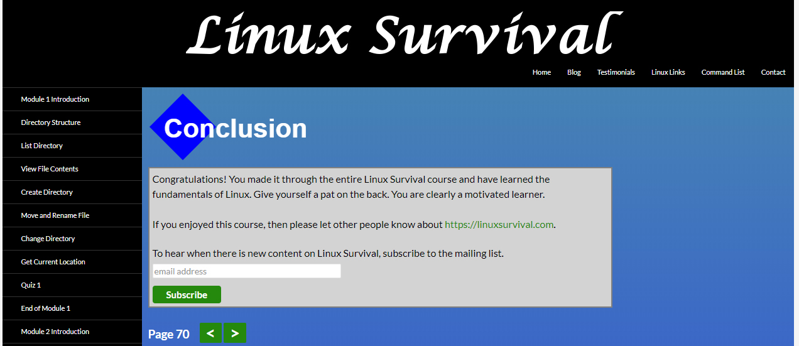
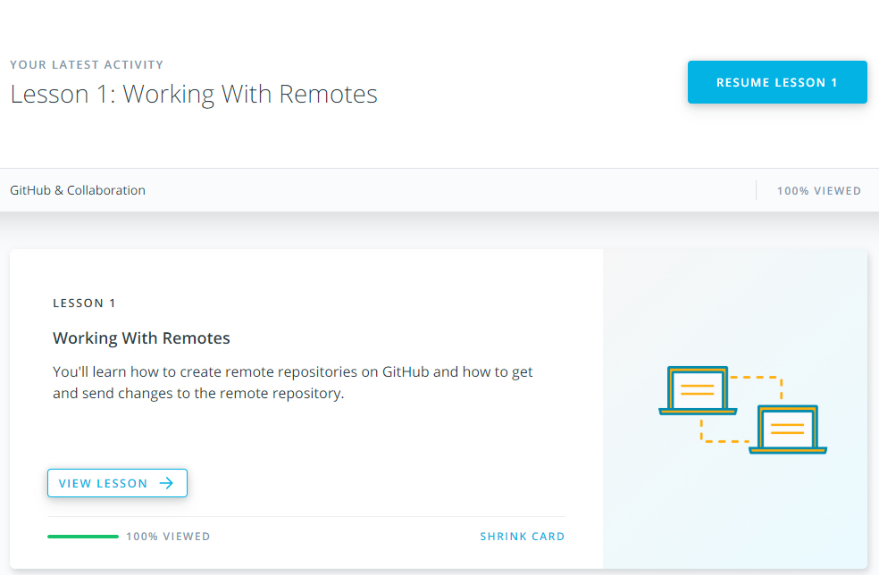
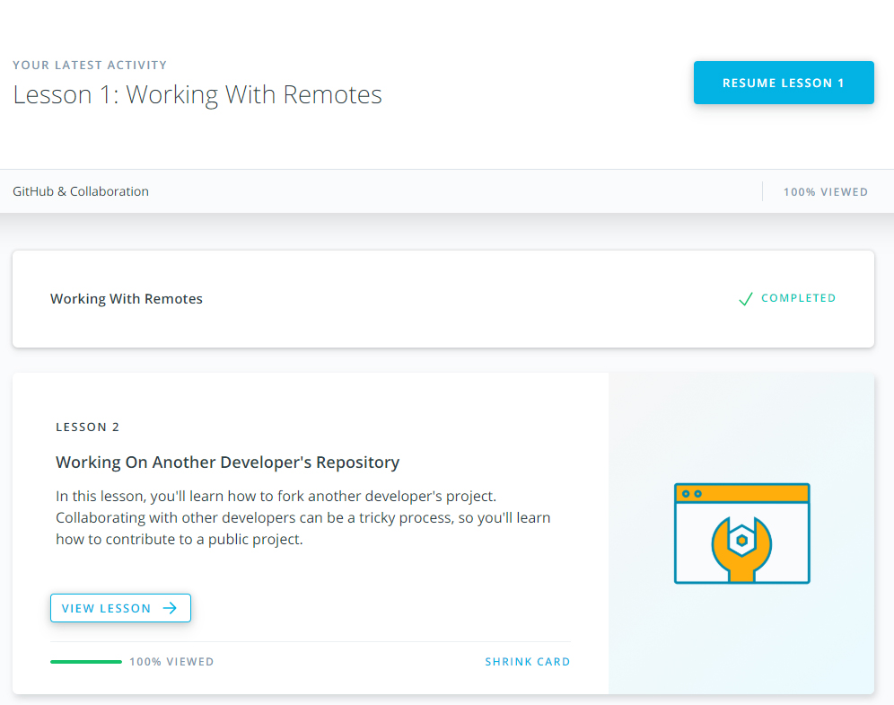
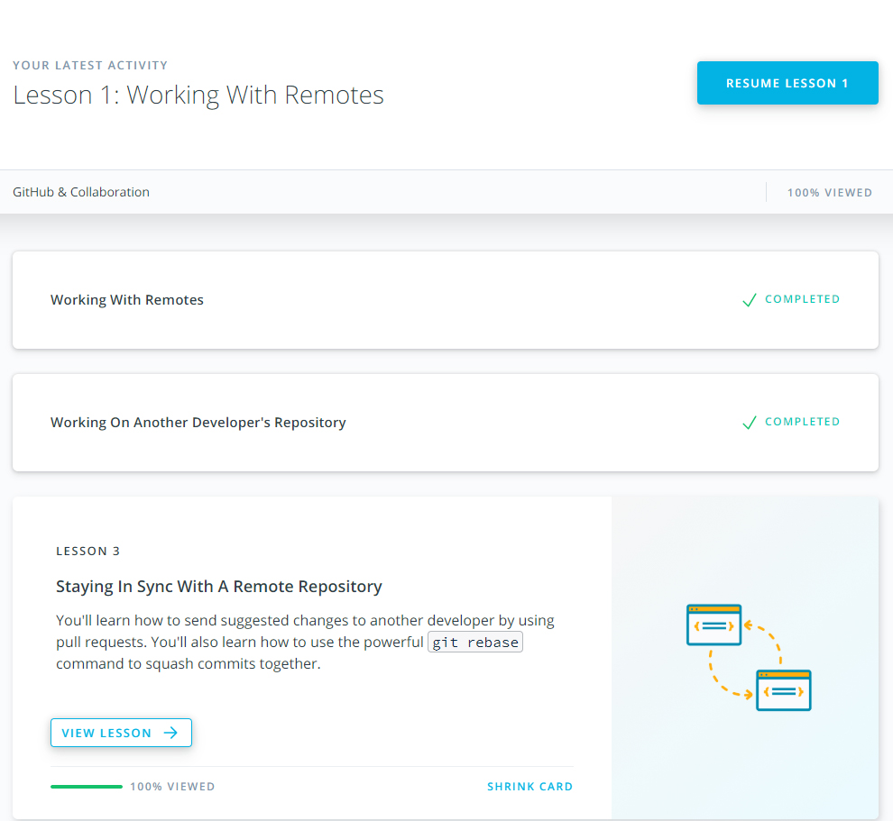

# kottans-backend
kottans-backend courses
## Git
**Git is a free and open source distributed version control system designed to handle everything from small to very large projects with speed and efficiency.**

**It is very important to be able to work with a version control system. For me it was the first acquaintance with the GIT. It is always interesting to learn something new!**

 

## Unix_Shell
**It was allways interesting to me to work with command line. Copying and renaming files without GUI rather cool!). I will improve my command line skills for team working in the future.**

## GitHub & Collaboration
**If You know how to work with a team, you are almost a programmer! GitHub & Collaboration cource helps you to improve teamworking skills.
`git rebase` isn't really all that difficult, and that you can bravely make changes to your repository without fear of doing any damage!
I intend to use it in future.**

